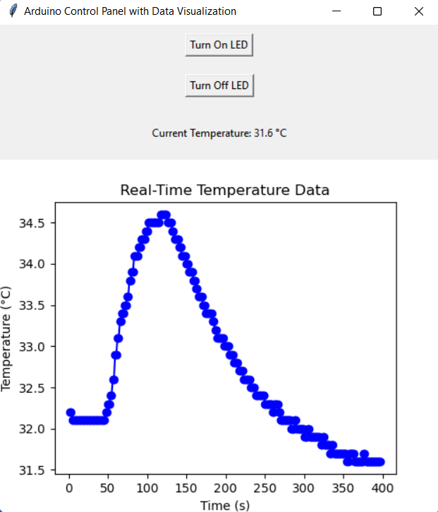

# Arduino Control Panel with Data Visualization



## This project provides a graphical user interface (GUI) to control an Arduino and visualize real-time temperature data. The GUI is built using Tkinter, and the data visualization is done using Matplotlib.

## Features

### Control Arduino: Turn an LED on and off.

### Real-Time Data Visualization: Display real-time temperature data from a sensor connected to the Arduino.

## Requirements

### Python 3.x

### Tkinter

### Matplotlib

### PySerial

## Installation

### Clone the repository:

```
git clone https://github.com/abhisheksharma1310/data-visualization-using-python.git
```

### Install the required Python packages:

```
pip install tkinter matplotlib pyserial
```

## Connect your Arduino:

Ensure your Arduino is connected to the correct COM port (e.g., COM15).

## Usage

### Run the script:

```
python control-and-visualize-data.py
```

### Control the LED:

Use the “Turn On LED” and “Turn Off LED” buttons to control the LED connected to the Arduino.

### View Temperature Data:

The current temperature will be displayed on the GUI.
Real-time temperature data will be plotted on the graph.

## Code Overview

### Serial Communication:

```Python
arduino = serial.Serial(port='COM15', baudrate=9600, timeout=1)
time.sleep(2)
```

### Send Commands to Arduino:

```Python
def send_command(command):
arduino.write(f"{command}\n".encode())
```

### Update Sensor Data:

```Python
def update_data():
send_command('READ_TEMP')
data = arduino.readline().decode('utf-8').strip()
if "Temperature" in data:
temp_value = float(data.split(": ")[1].replace("C", ""))
temperature_data.append(temp_value)
time_data.append(time.time() - start_time)
update_plot()
temp_label.config(text=f"Current Temperature: {temp_value} °C")
root.after(1000, update_data)
```

### Update Plot:

```Python
def update_plot():
ax.clear()
ax.plot(time_data, temperature_data, marker='o', color='b')
ax.set_title("Real-Time Temperature Data")
ax.set_xlabel("Time (s)")
ax.set_ylabel("Temperature (°C)")
canvas.draw()
```

### GUI Setup:

```Python
root = tk.Tk()
root.title("Arduino Control Panel with Data Visualization")
```

## Acknowledgements

### Tkinter for the GUI.

### Matplotlib for data visualization.

### PySerial for serial communication.
